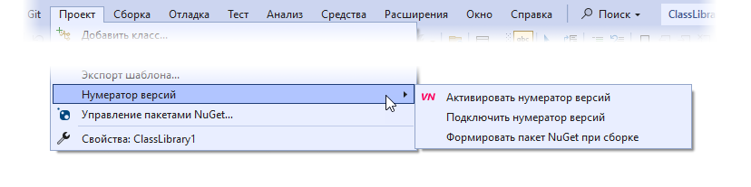
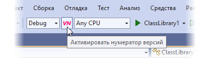

# Автоматический нумератор версий для Visual Studio

<!--

-->

## Использование

Расширение для Visual Studio содержит три команды. Они доступны в меню «Проект» при выделение проекта в Обозревателе решений.

### Подключение нумератора версий

Чтобы использовать функцию автоматического обновления версии в проекте, нужно сначала подключить нумератор к этому проекту. Для этого служит следующая команда:

{: .highlight }
ПРОЕКТ → Нумератор версий → Подключить нумератор версий

Нумератор необходимо подключить к каждому проекту, которому требуется функция автоматического обновления версии.

При подключении нумератора создаётся конфигурация сборки Preview (по умолчанию она отсутствует).

Для отключения нумератора от проекта служит следующая команда:

{: .highlight }
ПРОЕКТ → Нумератор версий → Отключить нумератор версий

При отключении нумератора, из проекта удаляются все связанные с ним данные.

### Активация нумератора версий

После подключения нумератора к нужным проектам, для включения функции автоматического обновления версии нужно его активировать. Для этого служит следующая команда:

{: .highlight }
ПРОЕКТ → Нумератор версий → Активировать нумератор версий

Для удобства доступа к команде, её кнопку можно вынести на панель инструментов. Она находится в категории «Проект», и имеет два состояния: нажатое и отпущенное.

Нумератор активируется для всех проектов в решении, к которым он подключён.

Для деактивации нумератора, используется та же команда повторно.

### Формирование пакета NuGet

Если проект создаёт библиотеку, можно также создавать пакет NuGet с её сборкой. Для включения этой возможности, служит следующая команда:

{: .highlight }
ПРОЕКТ → Нумератор версий → Формировать пакет NuGet при сборке

Для проектов стандартного, не‘SDK типа, нужно отредактировать манифест NuGet, который создаётся при выполнении команды.

Версия пакета будет синхронизирована с версией проекта, и так же будет обновляться при активированном нумераторе.

Для отключения создания пакета NuGet, служит следующая команда:

{: .highlight }
ПРОЕКТ → Нумератор версий → Не формировать пакет NuGet при сборке
